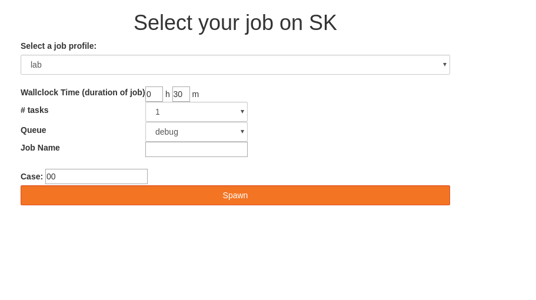

===============
Dynamic scripts
===============

Here is described the template syntax we adopted to provide an
automated user interface to a parametrized job script.

A very first example
--------------------

Here is the file 00 - lab.template

::

    ---------------------------------------------------------------------------------------------------------------------------------
    #!/bin/bash
    #SBATCH --time=0:20:00
    #SBATCH -n __nb_tasks;select;# tasks;1,2,3,4,8,16,32,64,128,512,1024__
    #SBATCH --partition=__partition;select;Queue;debug,workq__
    #SBATCH -J jupyterhub-singleuser
    #SBATCH -o __JOB_DIR__/__job_name;input;Job Name;text;my_job__.%j.out
    #SBATCH -e __JOB_DIR__/__job_name__.%j.err
    #

    echo RUNNING `which jupyter-labhub` on __nb_tasks__

    jupyter-labhub --ip="0.0.0.0" --port=__NOTEBOOK_PORT__  --notebook-dir="~/NOTEBOOKS" --debug
    ----------------------------------------------------------------------------------------------------------------------------------

will show in the hub as

display could and will be  improved of course...

See how ::
  
    __nb_tasks;select;# tasks;1,2,3,4,8,16,32,64,128,512,1024__

    
became a select item on the web page? Once value selected and the
button spawn hit, selected option are replaced in the job that is
ppawned to shaheen. The first command makes the connection with the
hub from the first node of the job::
  
  jupyter-labhub --ip="0.0.0.0" --port=__NOTEBOOK_PORT__  --notebook-dir="~/NOTEBOOKS" --debug

with *__NOTEBOOK_PORT__* also replaced with the current address of the hub
and a unique port number per job handled by the hub.

General syntax
--------------

Web components supported so far
-------------------------------

pre-defined environment variables
---------------------------------

   - *JOB_DIR*: directory where *kslhub* stores temporarily generated job scripts.
