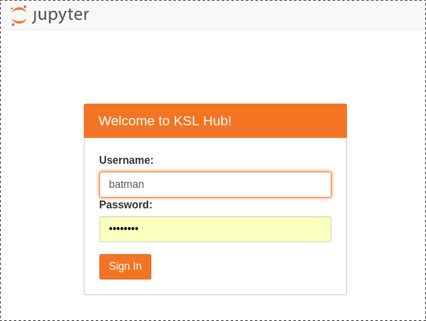

====================
Using *KslHub*
====================


Initial Configuration step
--------------------------

Installing some nice jupyter notebook extensions
````````````````````````````````````````````````

Once the *KslHub* package is installed (wether via Pip or anaconda),
one has to complete *KslHub* configuration by issuing the following
command::

    $ kslhub --init

Behind the scene, this command installs some nice jupyter notebook extensions as
  - the slurm magic package
  - the support of widget
  - the support of bash commands in a notebook cell

Starting the hub
----------------

The hub can be started with the following command::

    $ kslhub 

*KslHub* configuration file
```````````````````````````




By default, the hub interface shows this welcoming page on port 8000
with the user authenticated on the same machine thanks to regular
username/password credentials. It will search for job templates files
in the following directory::
  
     <current_directory>/job_templates


To change this default configuration, one can aedit these parameters
via a configuration file to be invoked as::

   
      $ kslhub --config <my_configuration_file>

A default configuration file is generated with the following command::

       $ kslhub --generate-config

A default set of job template files is generated with the following command::

       $ kslhub --generate-job-templates

       

  
   
    
